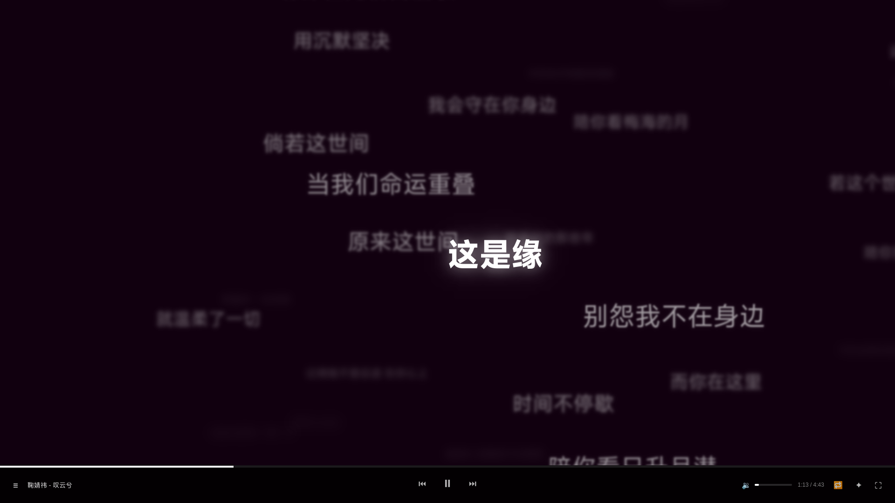
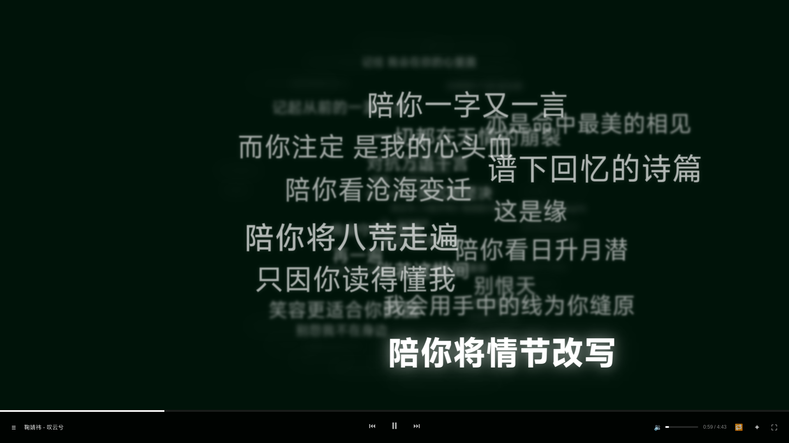
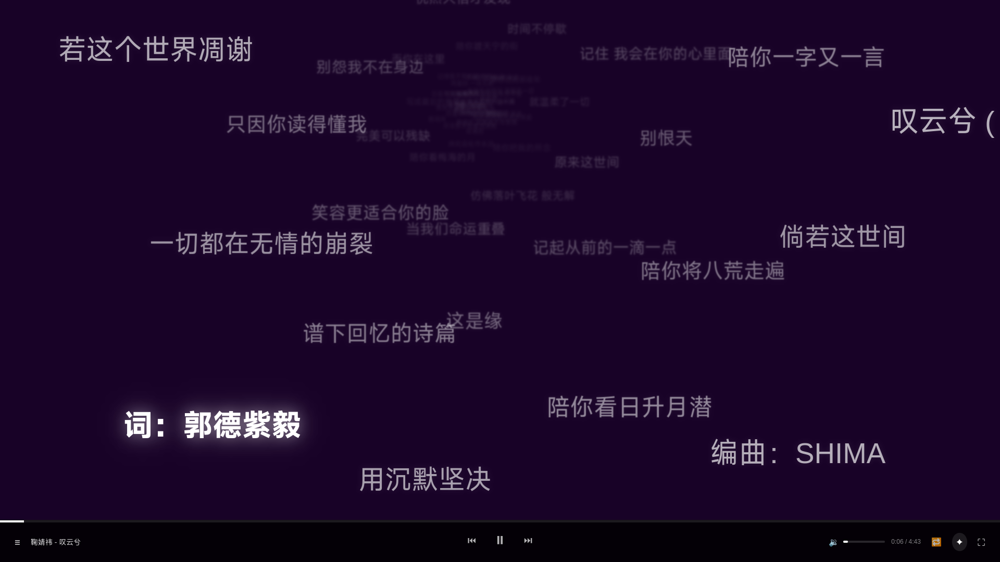
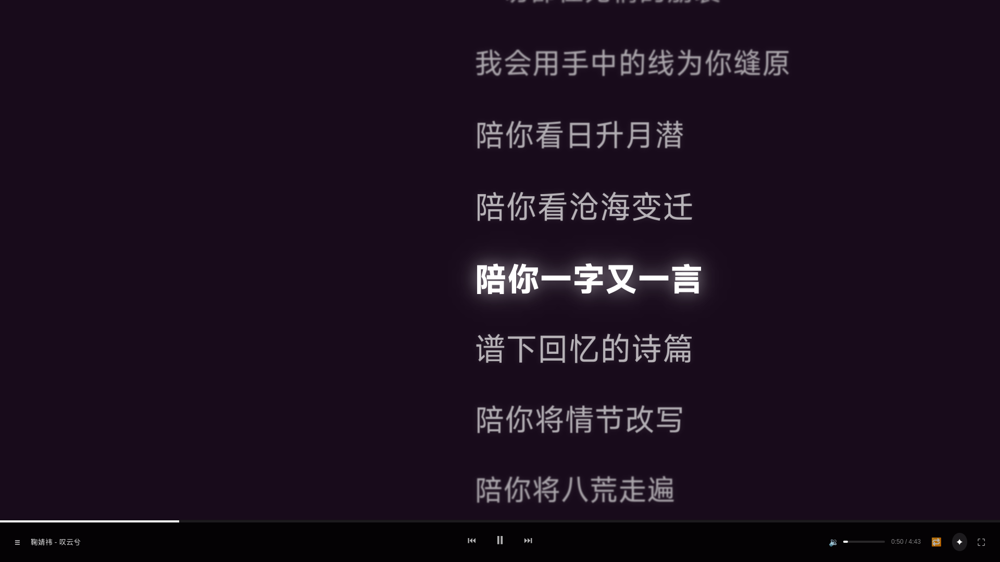

# LRC 歌词播放器

一个基于 React 和 Bun 的可视化歌词播放器，支持多种歌词展示模式，具有流畅动画和丰富交互。

## 功能特性

### 歌词展示模式

| 模式 | 说明 |
|------|------|
| **无序平铺** | 歌词随机平铺在屏幕上，自动避让重叠。支持焦点跟随和模糊效果。 |
| **无序词云** | 螺旋扩散布局，当前歌词居中显示。支持居中开关和模糊效果。 |
| **无序星云** | 小歌词聚集中心，大歌词散开到边缘。支持边缘跟踪和模糊效果。 |
| **纵向排列** | 传统纵向列表布局。支持焦点跟随和模糊效果。 |

### 截图





### 播放器控制

- 播放 / 暂停 / 上一首 / 下一首
- 进度条拖拽跳转
- 循环模式：单曲循环 / 列表循环 / 随机播放
- 播放列表面板
- 音量调节
- 全屏切换

### 交互功能

- 点击歌词跳转到对应播放时间
- 滚动鼠标滚轮调整歌词字体大小
- 鼠标拖拽平移歌词视图
- 全屏模式下鼠标静止 3 秒自动隐藏播放器
- 背景颜色随音乐律动变化

## 快速开始

### 环境要求

- [Bun](https://bun.sh) (v1.0+)

### 安装依赖

```bash
bun install
```

### 启动开发服务器

```bash
bun run index.ts
```

在浏览器中打开 http://localhost:3000

### 项目结构

```
lrc/
├── index.html          # 入口 HTML
├── index.ts            # Bun 服务器（静态托管 + API）
├── app.mjs             # React 前端（所有组件）
├── styles.css          # 样式文件
├── assets/
│   ├── music/          # MP3 音乐文件
│   └── lrc/            # LRC 歌词文件
└── package.json
```

### 添加音乐

将 `.mp3` 文件放入 `assets/music/`，对应的 `.lrc` 文件放入 `assets/lrc/`。同名文件（不含扩展名）会自动匹配。

## 技术栈

- **运行时**: Bun
- **前端**: React 18（ESM 导入）
- **样式**: 原生 CSS
- **服务端**: Bun.serve() 静态托管

## 开源协议

MIT
